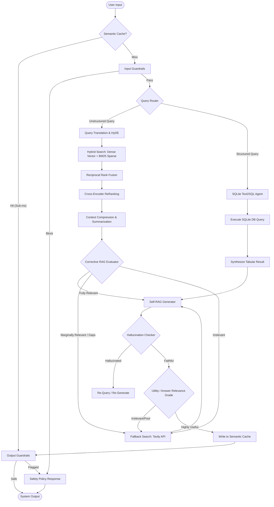

# 🧬 Enterprise Advanced RAG in LangGraph: Cyclic Cognitive Search Platform

[](https://python.org)
[](https://github.com/langchain-ai/langgraph)
[](https://deepmind.google/technologies/gemini/)
[](https://github.com/chroma-core/chroma)
[](https://numpy.org)

An enterprise-grade, state-of-the-art **Retrieval-Augmented Generation (RAG)** platform designed for production-scale, highly secure cognitive search and analytics. Choreographed by a cyclic state machine built on **LangGraph**, this pipeline seamlessly blends structured **Text-to-SQL database execution** with unstructured **parent-child vector retrieval**, reinforced by cross-encoder re-ranking, Hypothetical Document Embeddings (HyDE), Corrective RAG (CRAG) grader nodes, Self-RAG reflection loops, local semantic caching, and strict enterprise security guardrails.

---

## 🗺️ System Cognitive Architecture

Below is the state-driven cognitive architecture compiled and orchestrated inside LangGraph:



---

## ✨ Features & Component Design

1.  **Stateful Graph Orchestration (`src/graph/`)**: A cyclic state machine defining clear nodes (`retrieve`, `grade_docs`, `text_to_sql`, `generate`) and conditional routing edges compiled with error-resilience and local state retention.
2.  **Hybrid Retrieval with Reciprocal Rank Fusion (`src/retrieval/`)**: Melds semantic Dense Vector similarity and lexical BM25 token frequencies using **RRF** scores to capture both deep semantic context and exact word matches:
    $$\text{RRF Score}(d) = \sum_{m \in \text{Retrievers}} \frac{1}{k_{rrf} + r_m(d)}$$
3.  **Parent-Child Granular Chunking (`src/ingestion/`)**: Subdivides documents into overlapping child chunks to optimize precise vector search alignment, but retrieves and passes their holistic parent chunks to the LLM to preserve complete surrounding context.
4.  **Query Translation & HyDE (`src/transformation/`)**: Generates multi-query synonyms and Hypothetical Document Embeddings (HyDE) responses using Gemini models to bridge vocabulary gaps in asymmetric queries.
5.  **Cross-Encoder Re-Ranking & Context Compression (`src/ranking/`)**: Performs token-to-token cross-attention scoring to re-evaluate document relevance, stripping out irrelevant boilerplate down to individual sentence-level payloads.
6.  **Corrective RAG / CRAG (`src/agents/crag_evaluator.py`)**: Grader agent evaluates retrieval relevance and dynamically triggers web search fallback lookup (Tavily/Google Search) on irrelevant or ambiguous inputs.
7.  **Self-RAG Reflection Loops (`src/agents/self_rag_evaluator.py`)**: Checks for hallucinations (Faithfulness check) against database contexts and verifies response usefulness (Utility check), looping back to generate again if checks fail.
8.  **Structured Text-to-SQL DB Agent (`src/agents/text2sql.py`)**: Seamlessly reflects SQLite DDL schemas, translates natural analytical questions into valid SQLite SELECT commands, executes them, and formats tabular reports.
9.  **NumPy Semantic Cache (`src/cache/`)**: Performs cosine similarity checks over past cached queries using unit-normalized vector structures, serving identical semantic prompts in sub-milliseconds and bypassing LLM API charges:
    $$\text{Similarity} = \frac{\vec{q}_{new} \cdot \vec{q}_{cached}}{\|\vec{q}_{new}\| \|\vec{q}_{cached}\|}$$
10. **Enterprise Security Guardrails (`src/guardrails/`)**: Scans input prompts for injections, overrides, or jailbreaks, and sanitizes output vectors for secret token leaks (AWS/API keys) or PII (SSN/emails).

---

## 📂 Project Directory Structure

```
enterprise-advanced-rag/
├── README.md                 # Technical system manual (this file)
├── .env.example              # Environment variable template
├── .gitignore                # Staging exclusions rules
├── requirements.txt          # Python dependencies
├── setup.py                  # Local editable package installer
├── app.py                    # Interactive demo dashboard (Streamlit/FastAPI)
├── data/                     # Local document corpora and SQLite databases
├── notebooks/                # RAG development and evaluation notebooks
├── src/                      # Core production codebase
│   ├── agents/               # CRAG, Self-RAG, and Text-to-SQL agents
│   ├── cache/                # NumPy-based semantic caching module
│   ├── graph/                # LangGraph state configurations and compiled models
│   ├── guardrails/           # Input/Output sanitizers and PII filters
│   ├── ingestion/            # Parent-Child chunking and vector builders
│   ├── ranking/              # Cross-Encoder re-ranking and summarizers
│   ├── retrieval/            # Hybrid vector + BM25 and RRF processors
│   └── transformation/       # Query translation and HyDE generators
└── tests/                    # Core verification and unit tests
```

---

## ⚙️ Quick Start Installation

Follow these instructions to launch the interactive demo and local development environment:

### 1. Clone & Enter Repository
```bash
git clone https://github.com/Rishav-raj-github/enterprise-advanced-rag.git
cd enterprise-advanced-rag
```

### 2. Configure Environment Variables
Duplicate the environment template:
```bash
cp .env.example .env
```
Open `.env` and supply your API keys:
```env
GOOGLE_API_KEY=your_gemini_api_key_here
TAVILY_API_KEY=your_tavily_web_search_key_here
# Optional configuration parameters:
EMBEDDING_MODEL=models/embedding-001
GENERATOR_MODEL=gemini-2.0-flash
```

### 3. Install Package & Dependencies
Initialize a clean Python virtual environment and run the local package installer:
```bash
# Windows
python -m venv venv
venv\Scripts\activate

# Install in editable mode along with requirements
pip install -r requirements.txt
pip install -e .
```

### 4. Seed Database & Run Dashboard
Before querying, compile the vector databases and SQLite schemas:
```bash
python scripts/seed_database.py
```
Start the local Streamlit dashboard to interact with the cyclic graph:
```bash
streamlit run app.py
```
Open **[http://localhost:8501](http://localhost:8501)** in your browser and trace your queries through the LangGraph cognitive loops!
